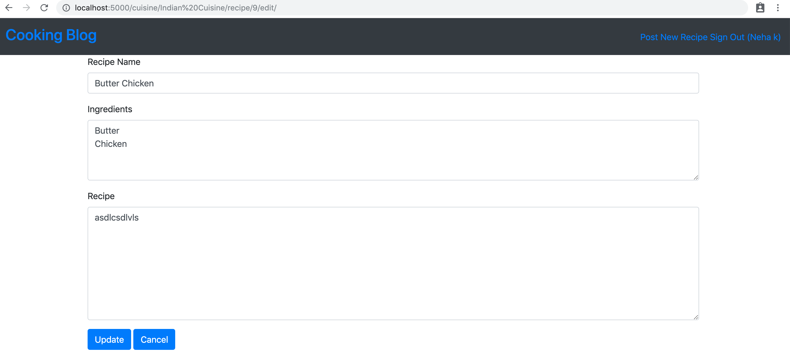
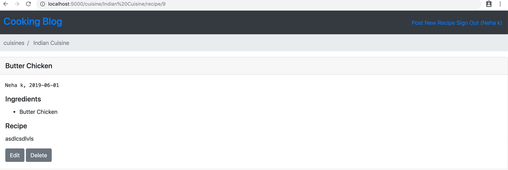

# Cooking Blog Web Application

## Overview

Item Catalog Project(Cooking Blog App) is a web application based on Flask. It enables user to manage and publish their
cooking recipes. Non authenticated users can read cooking
recipes while authenticated users can perform CRUD operations
on their recipes.

## Setup
1. Install Git
2. Install VirtualBox **https://www.virtualbox.org/wiki/Downloads**
3. Install Vagrant 
4. Extract project zip file

## Running VM (On terminal In Project Directory) 
1. Vagrant up
2. Vagrant ssh

## Loading Initial Data

To populate initial data set, execute **python initial_data.py**.

##Create Client ID and Secret
1. Go to Google APIs Console — **https://console.developers.google.com/apis**
2. Choose Credentials from the menu on the left.
3. Create an OAuth Client ID.
4. This will require you to configure the consent screen.
5. When you're presented with a list of application types, choose Web application.
6. You can then set the authorized JavaScript origins.(Ex.**http://localhost:5000**)
7. You will then be able to get the client ID and client secret.
8. Download the client secret as a JSON data file.

## Starting WebServer

Execute **python app.py** to start the Flask web server. In your browser visit **http://localhost:5000** to view the cooking blog app.  You should be able to view, add, edit, and delete recipes.

## Authentication

Application implements OAuth third party authentication using google APIs.

## REST Endpoints

Project also exposes REST endpoints to retrive JSON data from
the backend database.


```
GET /api/v1/cuisines
GET /api/v1/cuisines/<cuisine-name>
GET /api/v1/cuisines/<cuisine-name>/recipe/<recipe-id>
```

## Screenshots

### Home Page


### Recipe Page (Read only)


### Add New Recipe (After logging ,a user can add, edit and delete item)


### Edit Recipe


### Recipe Page (Editable)


### Flash Message


### Delete Recipe


### Cuisines JSON 


### Recipe JSON 
